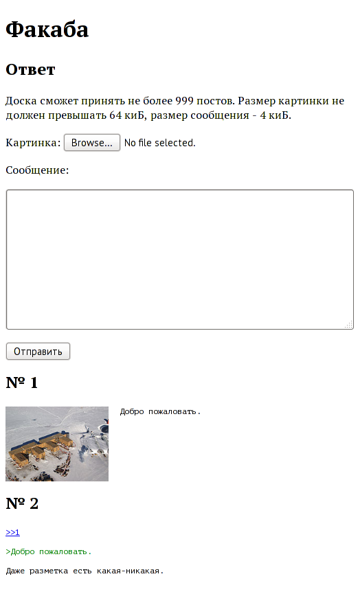

Факаба 1.4.0
============



Имиджбордный движок на Брейнфаке.

Обслуживает один тред, позволяет постить картинки, предоставляет средства для модерирования.

Преимущества
------------

- Безопасность. Программа выполняется в очень ограниченной виртуальной машине с 8 командами, код интерпретатора и сетевого драйвера занимает считанные десятки строк, его можно изучить за несколько минут. Транслятор в Си использует системный вызов [Seccomp](https://en.wikipedia.org/wiki/Seccomp) для создания песочницы.

- Переносимость. Используется самый распространённый диалект Брейнфака, для которого существует [огромное количество](https://esolangs.org/wiki/Brainfuck_implementations) интерпретаторов и компиляторов под разные платформы. Интерфейс сетевого драйвера может быть очень легко воспроизведён на множестве языков программирования.

- Совместимость с браузерами. Не требует включённого Джаваскрипта (хотя его наличие расширяет возможности движка), был протестирован в нескольких современных браузерах, включая Елинкс.

Особенности
-----------

Полностью синхронный, поддерживает одно соединение в момент времени, поэтому легко поддаётся ДДОСу кнопкой Ф5.

Системные требования
--------------------

Необходим интерпретатор [стандартного](http://www.muppetlabs.com/~breadbox/bf/standards.html) Брейнфака со следующими свойствами:
- 363 МиБ памяти, состоящей из восьмибитных ячеек;
- беззнаковое заворачивание при увеличении 255 или уменьшении 0;
- падает при выходе за границы памяти, попытке ввести ЕОФ или наличии несбалансированных скобок.

Для взаимодействия с сетью необходим драйвер, который позволит программе вызывать функции `accept`, `recv`, `send` и `close` с помощью стандартного ввода-вывода. К движку прилагается версия на Питоне 3.

В отдельном [репозитории](https://github.com/Jai9ihuj/Brainfuck-tools) лежит подходящий интерпретатор и транслятор в Си, тоже на третьем Питоне.

Запуск
------

Запуск осуществляется с помощью сетевого драйвера:

```
./run.py localhost 8008 ./fuckaba.bf
```

По умолчанию файл `fuckaba.bf` будет выполнен интерпретатором `Brainfuck-tools/interpreter.py`, поскольку так указано в его шебанге. Но данный интерпретатор крайне медленен, поэтому лучше скомпилировать движок в нативный код (для этого тоже потребуется директория `Brainfuck-tools` из отдельного репозитория):

```
make fuckaba
```

Подавать для оптимизации `CFLAGS=-O3` бессмысленно, при том, что это значительно замедляет компиляцию и требует много памяти. Запуск скомпилированного движка выглядит так:

```
./run.py localhost 8008 ./fuckaba
```

Администрирование
-----------------

Администратор может удалять посты. Если включен Джаваскрипт, то для этого придётся добавить к адресу страницы якорь `#admin`. Стандартный пароль `password`, может быть изменён в исходном коде в файле `lib/admin.txt` - он должен быть той же длины в 8 байтов. Это действие потребует пересборки файла `fuckaba.bf`:

```
make
```

Пароль можно изменить без пересборки, непосредственным редактированием файла `fuckaba.bf`. Специально для этого в нём есть подстрока `Пароль`, после которой следуют 8 строк с минусами. Количество минусов соотвествует коду символа.

В директории `resources` есть три файла:
- `index-head.txt` - ХТТП-заголовки главной страницы;
- `index-body.htm` - главная страница;
- `redirect-head.txt` - ХТТП-заголовки перенаправления на главную страницу.

Их можно изменять, после чего требуется пересобрать движок. ХТТП-заголовки надо разделять однобайтовым переводом строки `\n`, при сборке он будет преобразован в двухбайтовый `\r\n`.

Сохранение состояния
--------------------

Транслятор в Си поддерживает сохранение внутреннего состояния программы и последующее восстановление. С помощью этого можно делать бекапы или приостанавливать движок без потери постов.

Однако у сетевого драйвера тоже есть внутреннее состояние. Его сохранять смысла не имеет, но необходимо соблюдать дополнительные ограничения:
- делать дамп, когда движок простаивает в ожидании соединения;
- перед восстановлением выполнять:

```
./restore.py numbers.txt
```

Эта команда внесёт необходимые изменения в файл `numbers.txt`.

Обновление
----------

Движок можно обновить, в том числе и сменить админский пароль или поменять начало главной страницы, сохранив все посты. В пределах одной мажорной версии расположение и формат базы данных в памяти сохраняется, поэтому можно модифицировать дамп с помощью скрипта `restore.py`:

```
./restore.py numbers.txt memory.bin fuckaba.bf
```

Первые два файла будут изменены таким образом, чтобы их можно было использовать с новым исполняемым файлом, собраным из указанного кода `fuckaba.bf`.
